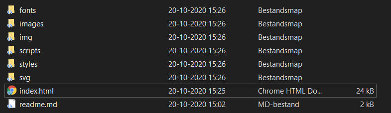
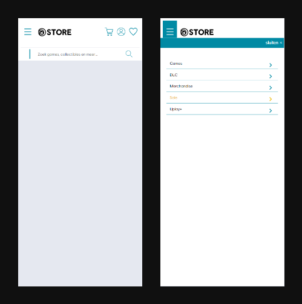
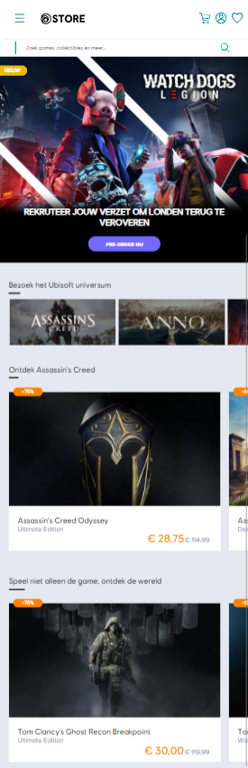
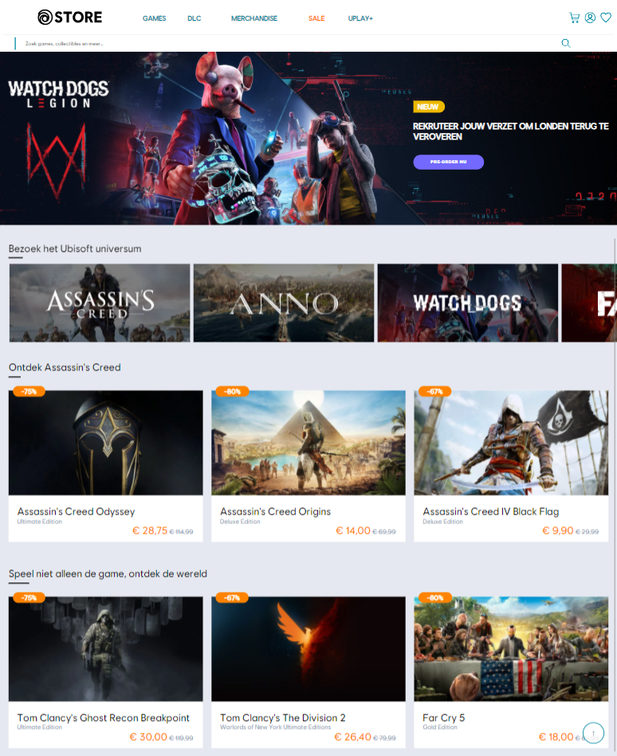
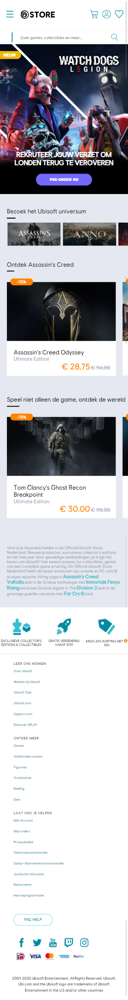
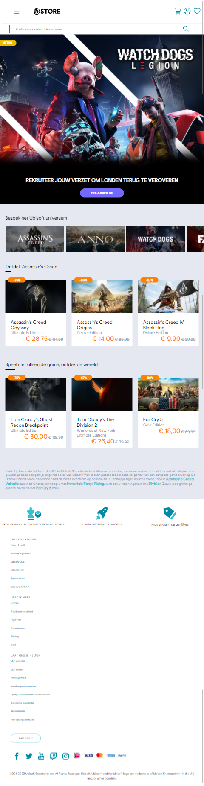

# Procesverslag
**Auteur:** Davey Zaal

Markdown cheat cheet: [Hulp bij het schrijven van Markdown](https://github.com/adam-p/markdown-here/wiki/Markdown-Cheatsheet). Nb. de standaardstructuur en de spartaanse opmaak zijn helemaal prima. Het gaat om de inhoud van je procesverslag. Besteedt de tijd voor pracht en praal aan je website.

## Bronnenlijst
1. https://css-tricks.com/almanac/properties/f/flex-wrap/
2. https://css-tricks.com/practical-css-scroll-snapping/

## Intake (week 1)

**Je startniveau:** Rood, er is altijd nog genoeg te leren.

**Je focus:** Responsive design, ik wil graag bekijken hoe responsive design werkt in development. Ik zou ook graag leuke functionaliteiten uit willen werken.

**Je opdracht:** https://store.ubi.com/nl/

**Screenshot(s):**
Mobiele versie:

  

Tablet versie:

  

Desktop versie:

  

**Breakdown-schets(en):**

  

<!--  -->

## Voortgang 1 (week 3)

### Stand van zaken

Ik was begonnen met content plukken van de Ubisoft website en ik had deze vervolgens gestructureerd in mappen.

  

Ook ben ik begonnen met het maken van de website, ik wilde starten met de header op mobiel en dat was al aardig gelukt.
Toen ben ik als een waterfal naar beneden gaan werken, het volgende was een banner die veranderd op breakpoints.

**Screenshot(s):**

  

  

### Agenda voor meeting

Ik had op dit moment nog geen vragen, ik kon lekker doorwerken met de website.

### Verslag van meeting

Ookal had ik zelf geen vragen hielpen de vragen van medestudenten wel.
Het was ook fijn om met elkaar naar andermans bugs te kijken, hier leer je ongemerkt toch wel veel van.

<!--  -->

## Voortgang 2 (week 5)

### Stand van zaken

Ik heb de afgelopen 2 weken niet heel erg veel gedaan omdat ik opzich al lekker bezig was en andere vakken iets meer tijd
vroegen. Maar ik heb zeker niet stil gezeten!

Ik heb een horizontale image scroll slider gemaakt en ik was begonnen aan een nieuwe section die ik best ingewikkeld vindt.
Het moet namelijk een carousel zijn op mobiel waarbij je de hele width steeds kan schuiven en op tablet/desktop moet het weer 3 columns naar elkaar zijn. 

**Screenshot(s):**

  

### Agenda voor meeting

- Hoe kan ik het beste de carousel aanpakken?

### Verslag van meeting

Ik zat eerst in de meeting met Sam en toen probeerder we samen een goede oplossing te bedenken maar we kwamen niet echt tot een simpele oplossing. Toen kwam Joost terug en hebben het vervolgens besproken met hem en hij zei meteen "is css scroll snapping niet wat?". Ik had er nog nooit van gehoord maar ik heb het daarna geprobeerd en binnen een kwartier werkte het precies zoals ik wilde. Dus bedankt Sam & Joost!

<!--  -->

## Voortgang 3 (week 6)

### Stand van zaken

Ik heb de afgelopen 2 weken een hoop gewerkt aan de eerste pagina. De carousel is af en werkt goed, ook is hij responsive.
Voor de rest heb ik kleine aanpassingen gedaan aan de code zodat deze wat schoner was.

**Screenshot(s):**

  

  

### Agenda voor meeting

- Amanda: Button een image geven, vragen over postioneren.
- Sabine en Davey: Stylen van form elementen.
- Noah en Cas: vraag hamburger menu mobiel naar volledig menu op desktop.

### Verslag van meeting

Meeting ging goed, we hebben de agenda besproken. De vraag over het stylen van form elementen is beantwoord maar het is erg lastig om te doen.

<!--  -->

## Eindgesprek (week 7/8)

De laatste 2 weken heb ik voornamelijk besteed aan responsive maken, hier en daar werkte het niet naar me zin. Ik heb een beetje gewerkt aan de tabindex en eigenlijk de puntjes op de i gezet zodat ik klaar ben voor het eindgesprek. 

Wat goed ging tijden dit vak was het zelf debuggen van bugs en het sschrijven van code, ik heb geprobeerd zoveel mogelijk uit me hoofd te doen om zo zelf meer te begrijpen hoe de code werkt. Ook heb ik veel geexperimenteerd met elementen en/of styling, bijvoorbeeld mijn ervaring met grid was best laag dus ik heb meerdere grid formaties gemaakt om te kijken hoe het nou werkt.

Ik heb eigenlijk niet heel veel problemen gehad tijdens het maken van de website, behalve dan kleine bugs maar dat heb je altijd bij het maken van een website. Het is eigenlijk niet voorgekomen dat ik niet verder kon omdat ik vast liep of iets dergelijks. Het ging eigenlijk erg goed.

**Screenshot(s):**

  

  

  

