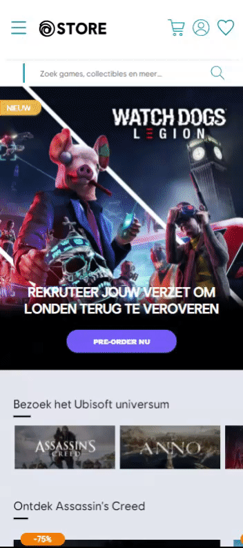
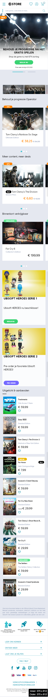
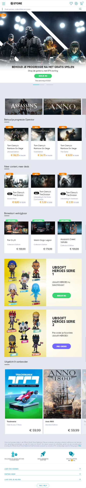
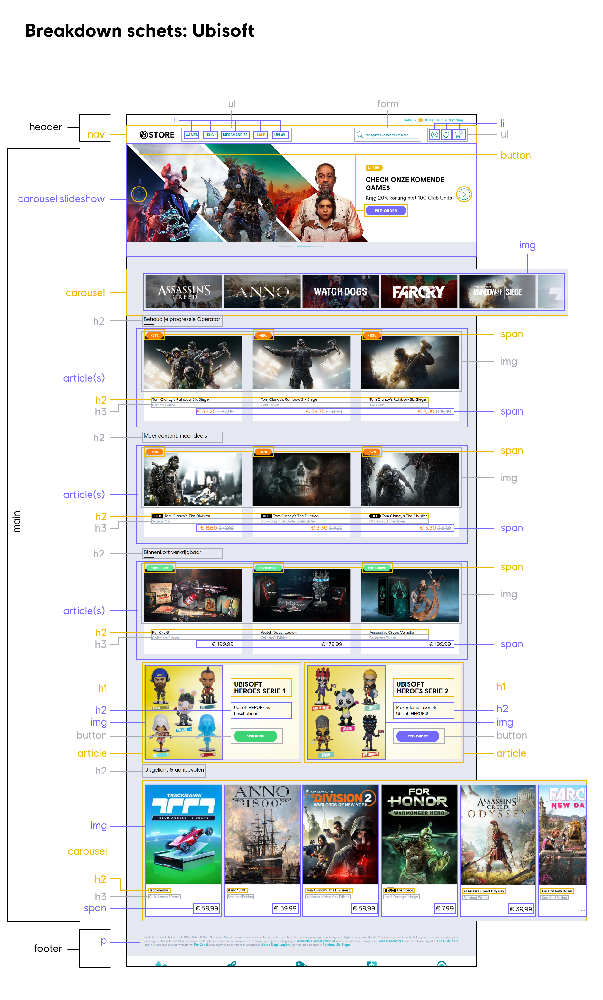

# Procesverslag
**Auteur:** Davey Zaal

Markdown cheat cheet: [Hulp bij het schrijven van Markdown](https://github.com/adam-p/markdown-here/wiki/Markdown-Cheatsheet). Nb. de standaardstructuur en de spartaanse opmaak zijn helemaal prima. Het gaat om de inhoud van je procesverslag. Besteedt de tijd voor pracht en praal aan je website.

Images geupload naar: https://imgur.com/a/uWDfLEm

## Bronnenlijst
1. https://css-tricks.com/almanac/properties/f/flex-wrap/
2. https://css-tricks.com/practical-css-scroll-snapping/
3. -...-

## Eindgesprek (week 7/8)

-dit ging goed & dit was lastig-

**Screenshot(s):**

-screenshot(s) van je eindresultaat-

## Voortgang 3 (week 6)

-same as voortgang 1-

## Voortgang 2 (week 5)

-same as voortgang 1-

## Voortgang 1 (week 3)

### Stand van zaken

-dit ging goed & dit was lastig-

**Screenshot(s):**

-screenshot(s) van hoe ver je bent-

### Agenda voor meeting

-samen met je groepje opstellen-

### Verslag van meeting

-na afloop snel uitkomsten vastleggen-

## Intake (week 1)

**Je startniveau:** Rood, er is altijd genoeg te leren.

**Je focus:** Responsive design, ik wil graag bekijken hoe responsive design werkt in development. 

**Je opdracht:** https://store.ubi.com/nl/

**Screenshot(s):**
Mobiele versie:

Tablet versie:

**Breakdown-schets(en):**

